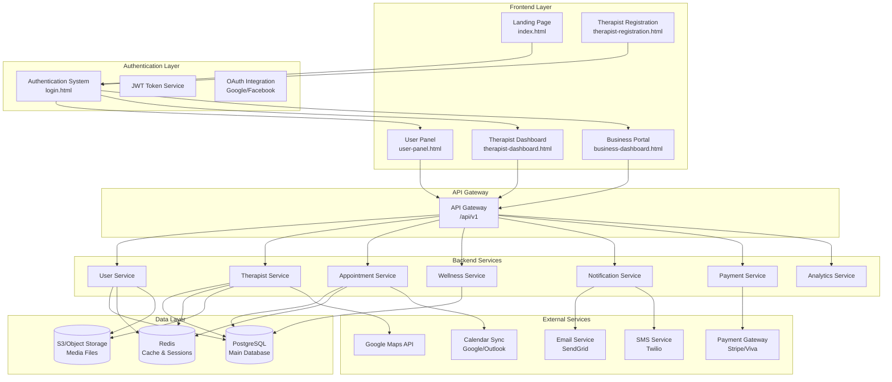
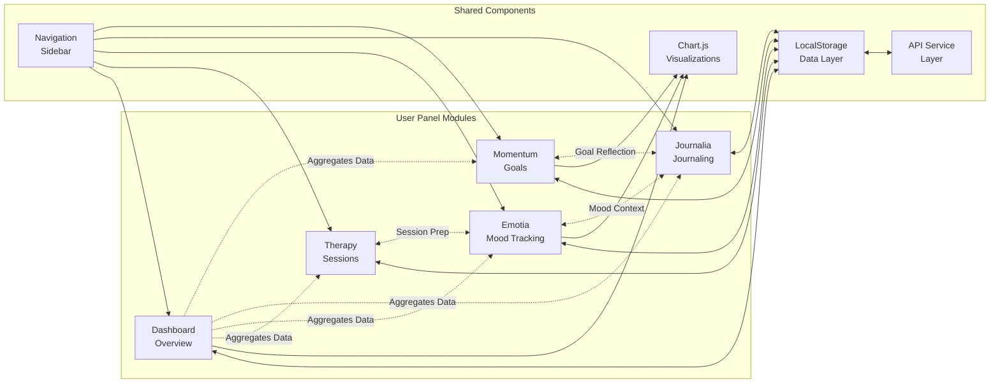
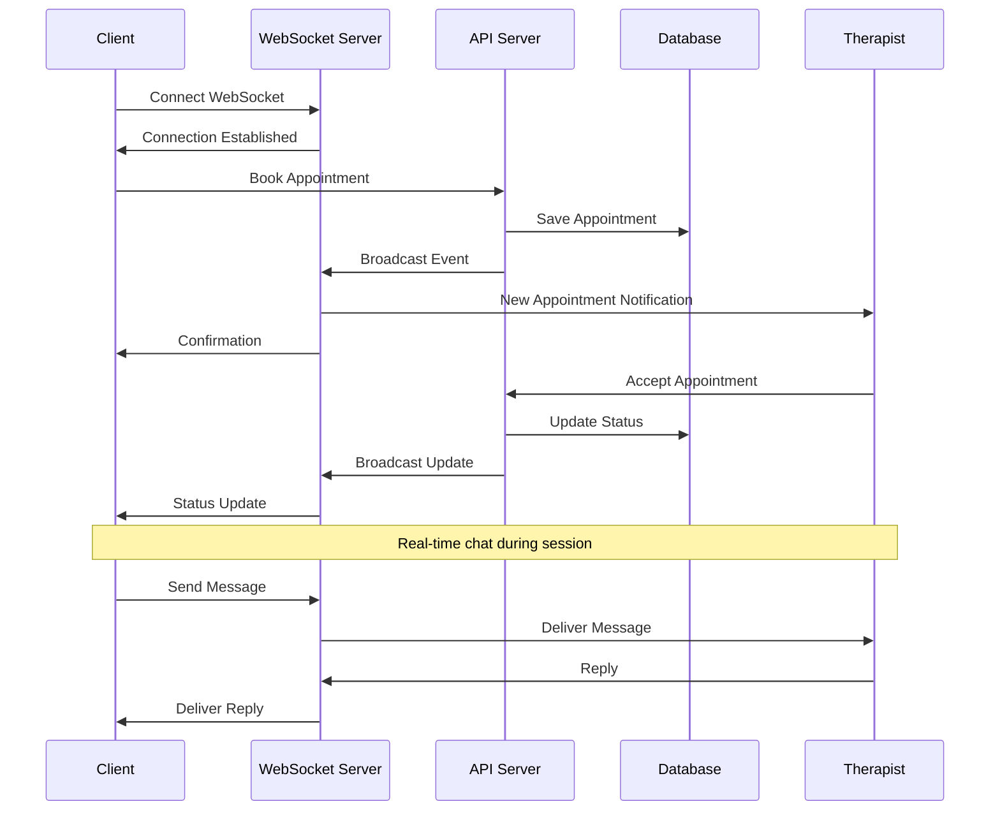
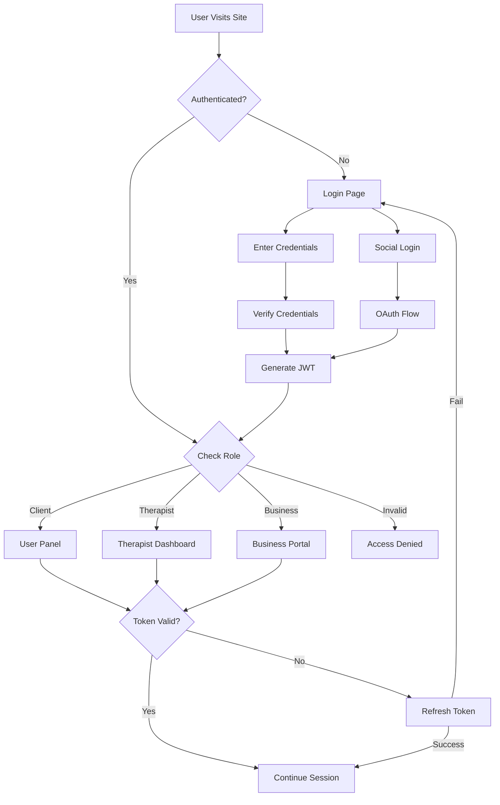
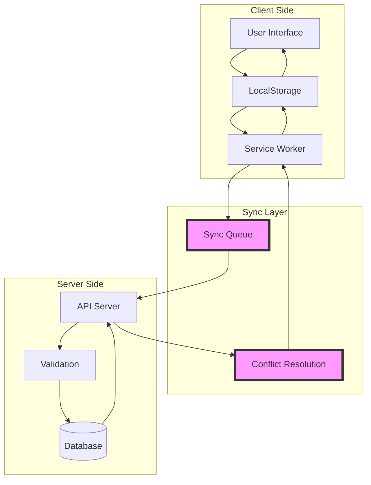
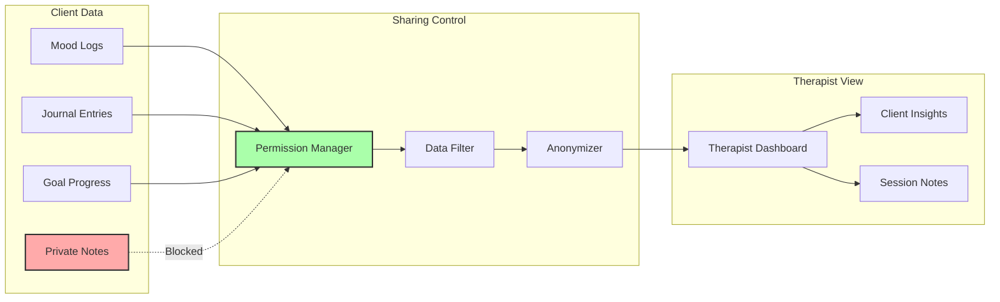
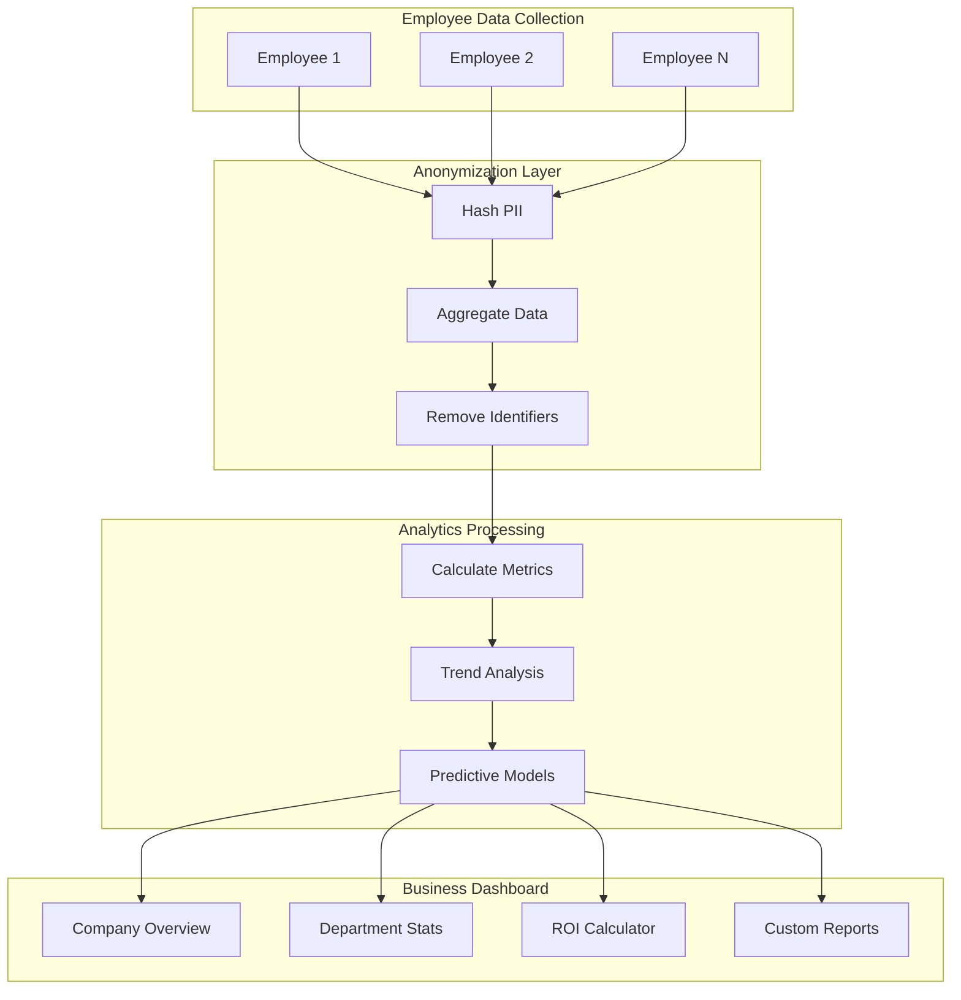
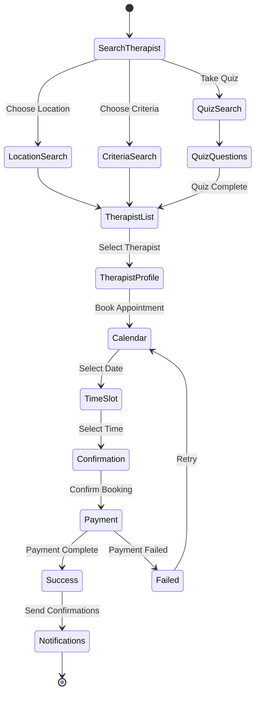
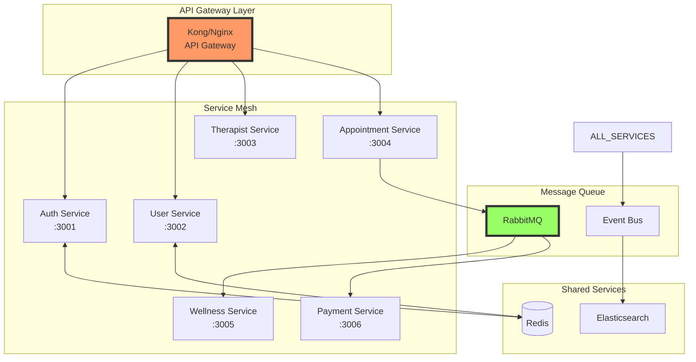
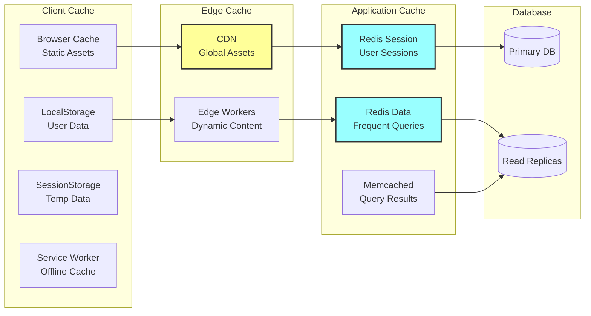

# Therapy Field - Visual Architecture Diagrams

## 1. High-Level System Architecture

## 2. User Panel Module Integration

## 3. Real-Time Communication Flow

## 4. Authentication & Authorization Flow

## 5. Data Synchronization Architecture

## 6. Therapist-Client Data Sharing

## 7. Business Portal Analytics Flow

## 8. Appointment Booking Flow

## 9. Microservices Communication Pattern

## 10. Caching Strategy Layers

## Implementation Priority Matrix

| Component | Priority | Complexity | Dependencies |
|-----------|----------|------------|--------------|
| Authentication System | Critical | High | None |
| User Panel Integration | Critical | Medium | Auth |
| Therapist Dashboard | High | High | Auth, API |
| API Gateway | Critical | Medium | None |
| Database Schema | Critical | Medium | None |
| Payment Integration | High | High | Auth, API |
| Real-time Features | Medium | High | WebSocket |
| Business Portal | Medium | High | Auth, Analytics |
| Mobile Apps | Low | High | API Complete |
| AI Features | Low | Very High | Data Collection |

## Technology Stack Recommendations

### Frontend
- **Framework**: React/Vue.js for component reusability
- **State Management**: Redux/Vuex for complex state
- **UI Library**: Material-UI or Ant Design
- **Build Tool**: Vite for fast development

### Backend
- **API**: Node.js with Express or Fastify
- **Microservices**: Docker + Kubernetes
- **Message Queue**: RabbitMQ or Apache Kafka
- **Cache**: Redis for sessions, Memcached for data

### Database
- **Primary**: PostgreSQL for relational data
- **NoSQL**: MongoDB for flexible schemas
- **Time Series**: InfluxDB for analytics
- **Search**: Elasticsearch for full-text search

### Infrastructure
- **Cloud**: AWS or Google Cloud Platform
- **CDN**: CloudFront or Cloudflare
- **Monitoring**: Prometheus + Grafana
- **Logging**: ELK Stack (Elasticsearch, Logstash, Kibana)

This visual architecture provides a comprehensive view of how all components of the Therapy Field platform interconnect and communicate.